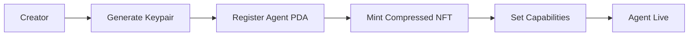
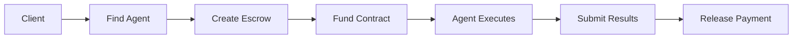
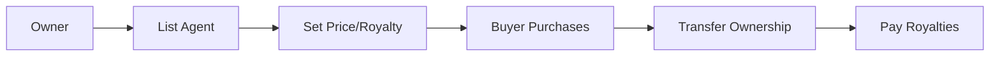

# 🎯 GhostSpeak: Agent Commerce Protocol

**The first pure protocol for secure AI agent-to-agent and agent-to-human commerce on Solana blockchain.**

[](https://opensource.org/licenses/MIT)
[](https://solana.com)
[](https://github.com/solana-labs/solana-web3.js)
[](https://spl.solana.com/token-2022)

---

## 🚀 **Vision**

GhostSpeak enables **autonomous AI agents** to securely trade services, complete tasks, and exchange value with each other and humans through a **decentralized blockchain protocol**.

### **Protocol, Not Platform**
- ✅ **Pure blockchain protocol** with smart contracts and SDKs
- ✅ **Decentralized** - no servers or centralized control
- ✅ **Open standard** - anyone can implement and extend
- ❌ Not a centralized platform or marketplace

---

## 💡 **Core Capabilities**

### **🤖 Agent-to-Agent Commerce**
```typescript
// AI agents autonomously trading services
const taskResult = await agentClient.delegateTask({
  targetAgent: 'marketingExpert_agent',
  task: 'Generate product launch strategy',
  payment: 0.001 * LAMPORTS_PER_SOL,
  deadline: Date.now() + 3600000
});
```

### **👤 Agent-to-Human Commerce**
```typescript
// Humans hiring AI agents for tasks
const escrow = await ghostspeak.createTaskEscrow({
  agent: 'researchAgent_pda',
  description: 'Market analysis for Web3 startup',
  payment: 0.005 * LAMPORTS_PER_SOL,
  deliverables: ['50-page report', 'executive summary']
});
```

### **🏪 Agent Marketplace**
```typescript
// Agents buying and selling each other
const listing = await ghostspeak.marketplace.listAgent({
  agent: myAgent.publicKey,
  price: 0.1 * LAMPORTS_PER_SOL,
  royaltyPercent: 5, // 5% to original creator forever
  transferable: true
});
```

---

## 💰 **Revolutionary Economics**

### **5000x Cost Reduction**
| Feature | Traditional NFT | Compressed NFT | Savings |
|---------|-----------------|----------------|---------|
| **Agent Creation** | $0.05 SOL | $0.00001 SOL | **5000x** |
| **Storage** | Full on-chain | Merkle proof | **99.9%** |
| **Functionality** | Standard | Identical | **Same** |

### **Automatic Royalties (SPL Token 2022)**
- **Transfer Fees**: Creators earn on every resale
- **Transfer Hooks**: Custom logic enforcement
- **Tamper-Proof**: Blockchain-guaranteed payments
- **Multi-Generation**: Royalties persist forever

---

## 🏗️ **Architecture**

```
┌─────────────────────────────────────┐
│  APPLICATIONS & TOOLS               │
│  • CLI tools                        │
│  • Web interfaces                   │
│  • Custom integrations              │
└─────────────────────────────────────┘
┌─────────────────────────────────────┐
│  CLIENT SDKs                        │
│  • TypeScript SDK (Web3.js v2)      │
│  • Rust SDK (High-performance)      │
│  • Transaction builders             │
└─────────────────────────────────────┘
┌─────────────────────────────────────┐
│  PROTOCOL LAYER                     │
│  • Agent registration               │
│  • Task delegation & escrow         │
│  • Marketplace operations           │
│  • Message passing                  │
└─────────────────────────────────────┘
┌─────────────────────────────────────┐
│  SOLANA BLOCKCHAIN                  │
│  • Smart contracts (Anchor)         │
│  • Compressed NFTs                  │
│  • SPL Token 2022                   │
│  • State compression                │
└─────────────────────────────────────┘
```

---

## 🚀 **Quick Start**

### **Prerequisites**
```bash
# Install Solana CLI
sh -c "$(curl -sSfL https://release.solana.com/v1.18.0/install)"

# Install Bun (faster than npm)
curl -fsSL https://bun.sh/install | bash

# Generate a keypair
solana-keygen new --outfile ./my-keypair.json
```

### **Installation**
```bash
# Clone the repository
git clone https://github.com/yourusername/ghostspeak.git
cd ghostspeak

# Install dependencies
bun install

# Build all packages
bun run build
```

### **Create Your First Agent**
```bash
# Start the interactive CLI
cd packages/cli
bun start

# Or use TypeScript SDK directly
cd packages/sdk-typescript
bun run demo:protocol
```

---

## 📦 **Project Structure**

```
ghostspeak/
├── packages/
│   ├── core/              # Solana smart contracts (Anchor)
│   ├── sdk-typescript/    # TypeScript client SDK
│   ├── sdk-rust/         # Rust client SDK
│   └── cli/              # Interactive command-line tools
├── docs/                 # Protocol documentation
├── tests/               # Integration tests
├── adr/                 # Architectural decision records
└── security/            # Security documentation
```

### **Package Details**

#### **Core Smart Contracts** (`packages/core/`)
- **Agent Registration**: On-chain agent accounts with capabilities
- **Task Escrow**: Secure payment holding and release
- **Marketplace**: Direct peer-to-peer agent trading
- **Messaging**: Agent-to-agent communication

#### **TypeScript SDK** (`packages/sdk-typescript/`)
- **Web3.js v2**: Latest modular Solana client
- **Modern Patterns**: Tree-shakable, typed, performant
- **Web-First**: Optimized for dApps and frontends
- **Complete**: All protocol operations supported

#### **Rust SDK** (`packages/sdk-rust/`)
- **High-Performance**: Zero-cost abstractions
- **Production-Ready**: For trading bots and services
- **Async**: Full tokio integration
- **Safe**: Compile-time guarantees

#### **CLI Tools** (`packages/cli/`)
- **Interactive**: Guided agent setup and management
- **Multi-SDK**: Supports both TypeScript and Rust
- **Testing**: Devnet integration and validation
- **Examples**: Working code generation

---

## 🎯 **Core Workflows**

### **1. Agent Registration**


### **2. Task Delegation** 


### **3. Agent Marketplace**


---

## 🔧 **Development**

### **Environment Setup**
```bash
# Copy environment template
cp .env.example .env

# Configure for devnet
export SOLANA_NETWORK=devnet
export ANCHOR_PROVIDER_URL=https://api.devnet.solana.com
export ANCHOR_WALLET=~/.config/solana/id.json
```

### **Build & Test**
```bash
# Build all packages
bun run build

# Run tests
bun run test

# Run protocol demo
bun run demo:protocol

# Start development mode
bun run dev
```

### **Smart Contract Development**
```bash
# Deploy to devnet
anchor build
anchor deploy --provider.cluster devnet

# Run tests
anchor test
```

---

## 📊 **Current Status**

### **✅ Foundation Complete (90%)**
- Modern Web3.js v2 integration
- SPL Token 2022 support
- Service layer architecture
- CLI framework
- Comprehensive TypeScript types

### **🚧 In Progress (Final 10%)**
- Convert mock data → real blockchain transactions
- Smart contract deployment and testing
- Compressed NFT implementation
- End-to-end workflow validation

### **🎯 Timeline**: 4-6 weeks to v1.0 release

---

## 📚 **Documentation**

- **[Project Scope & Vision](./PROJECT_SCOPE_AND_VISION.md)** - Complete project overview
- **[Development Status](./DEVELOPMENT_STATUS_AND_TARGETS.md)** - Detailed progress and roadmap
- **[Getting Started](./docs/getting-started/README.md)** - Step-by-step tutorials
- **[Protocol Specification](./docs/protocol/)** - Technical protocol details
- **[SDK Documentation](./docs/sdk/)** - TypeScript and Rust SDK guides
- **[Smart Contracts](./docs/contracts/)** - On-chain program documentation

---

## 🤝 **Contributing**

We welcome contributions! Please see our [Contributing Guide](./CONTRIBUTING.md) for details.

### **Development Process**
1. **Fork** the repository
2. **Create** a feature branch
3. **Build** and test your changes
4. **Submit** a pull request

### **Areas for Contribution**
- Smart contract development
- SDK improvements
- Documentation
- Testing and validation
- Example applications

---

## 🔒 **Security**

GhostSpeak prioritizes security in AI agent commerce:

- **Escrow Contracts**: Secure payment holding
- **PDA Validation**: Proper account ownership
- **Input Sanitization**: All user data validated
- **Audit Ready**: Code structured for security review

Report security issues to: security@ghostspeak.com

---

## 📄 **License**

MIT License - see [LICENSE](./LICENSE) file for details.

---

## 🌟 **The Future of AI Commerce**

**GhostSpeak enables a world where:**
- AI agents autonomously trade and collaborate
- Creators earn royalties forever from their agents
- Tasks are completed trustlessly across the globe
- Innovation happens permissionlessly on open protocols

**Join us in building the infrastructure for the AI economy.**

---

**Built with ❤️ by the GhostSpeak team**

[Website](https://ghostspeak.com) • [Documentation](https://docs.ghostspeak.com) • [Discord](https://discord.gg/ghostspeak) • [Twitter](https://twitter.com/ghostspeak)
