# Testing Guide

Comprehensive testing strategy for podAI Core following Test-Driven Development (TDD) principles and modern testing best practices for 2024.

## Quick Navigation

| Testing Type | Coverage | Automation | Documentation |
|--------------|----------|------------|---------------|
| [Unit Testing](#unit-testing) | 90%+ | ✅ Fully Automated | [Jest/Vitest Guide](./unit-testing.md) |
| [Integration Testing](#integration-testing) | 85%+ | ✅ CI/CD Pipeline | [Integration Guide](./integration-testing.md) |
| [Smart Contract Testing](#smart-contract-testing) | 100% | ✅ Anchor Framework | [Solana Testing](./contract-testing.md) |
| [End-to-End Testing](#e2e-testing) | Key Flows | ✅ Playwright | [E2E Guide](./e2e-testing.md) |
| [Performance Testing](#performance-testing) | Critical Paths | ✅ Load Testing | [Performance Guide](./performance-testing.md) |
| [Security Testing](#security-testing) | All Endpoints | ✅ Automated Scans | [Security Guide](./security-testing.md) |

## Testing Philosophy

podAI Core follows **Test-Driven Development (TDD)** principles with the Red-Green-Refactor cycle:

```mermaid
graph LR
    A[🔴 Write Failing Test] --> B[🟢 Write Minimal Code]
    B --> C[🔵 Refactor & Optimize]
    C --> A
    
    style A fill:#ffebee
    style B fill:#e8f5e8
    style C fill:#e3f2fd
```



### Core Testing Principles

1. **Test First**: Write tests before implementation
2. **Fast Feedback**: Tests complete in under 30 seconds
3. **Reliable**: Tests pass consistently (>99.5% reliability)
4. **Maintainable**: Tests are easy to read and update
5. **Comprehensive**: Cover all critical user journeys

## Testing Architecture

### Five-Layer Testing Strategy


## Unit Testing

### Testing Framework Setup

**TypeScript/JavaScript (Vitest)**
```bash
# Install testing dependencies
bun add -D vitest @vitest/ui @testing-library/react jsdom

# Run tests
bun test
bun test:watch
bun test:coverage
```

**Rust (Cargo Test)**
```bash
# Run all tests
cargo test

# Run with coverage
cargo tarpaulin --out html
```

### Unit Test Examples

**TypeScript Service Test**
```typescript
// tests/services/agent.service.test.ts
import { describe, it, expect, beforeEach, vi } from 'vitest';
import { AgentService } from '../src/services/AgentService';
import { mockProvider } from './mocks/provider';

describe('AgentService', () => {
  let agentService: AgentService;
  
  beforeEach(() => {
    agentService = new AgentService(mockProvider);
  });

  describe('registerAgent', () => {
    it('should successfully register a new agent', async () => {
      // Arrange
      const agentData = {
        name: 'TestAgent',
        description: 'A test agent',
        capabilities: ['chat', 'analysis']
      };

      // Act
      const result = await agentService.registerAgent(agentData);

      // Assert
      expect(result).toMatchObject({
        name: 'TestAgent',
        description: 'A test agent',
        capabilities: ['chat', 'analysis']
      });
      expect(result.publicKey).toBeDefined();
      expect(result.registrationTime).toBeInstanceOf(Date);
    });

    it('should throw error for invalid agent data', async () => {
      // Arrange
      const invalidData = {
        name: '', // Invalid empty name
        capabilities: []
      };

      // Act & Assert
      await expect(
        agentService.registerAgent(invalidData)
      ).rejects.toThrow('Agent name cannot be empty');
    });
  });
});
```

**Rust Unit Test**
```rust
// src/services/agent_service.rs
#[cfg(test)]
mod tests {
    use super::*;
    use crate::test_utils::*;

    #[tokio::test]
    async fn test_register_agent_success() {
        // Arrange
        let mut agent_service = AgentService::new(mock_client()).await;
        let agent_params = AgentRegistrationParams {
            name: "TestAgent".to_string(),
            description: "A test agent".to_string(),
            capabilities: vec!["chat".to_string(), "analysis".to_string()],
            metadata_uri: "ipfs://test".to_string(),
        };

        // Act
        let result = agent_service
            .register_agent(agent_params)
            .await;

        // Assert
        assert!(result.is_ok());
        let agent = result.unwrap();
        assert_eq!(agent.name, "TestAgent");
        assert_eq!(agent.capabilities.len(), 2);
    }

    #[tokio::test]
    async fn test_register_agent_invalid_name() {
        // Arrange
        let mut agent_service = AgentService::new(mock_client()).await;
        let invalid_params = AgentRegistrationParams {
            name: "".to_string(), // Invalid empty name
            description: "Test".to_string(),
            capabilities: vec![],
            metadata_uri: "ipfs://test".to_string(),
        };

        // Act
        let result = agent_service
            .register_agent(invalid_params)
            .await;

        // Assert
        assert!(result.is_err());
        assert_eq!(
            result.unwrap_err().to_string(),
            "Agent name cannot be empty"
        );
    }
}
```

## Integration Testing

### Service Integration Tests

**API Integration Test**
```typescript
// tests/integration/api.integration.test.ts
import { describe, it, expect, beforeAll, afterAll } from 'vitest';
import { TestEnvironment } from '../utils/test-environment';
import { AgentService, MessageService } from '../../src/services';

describe('Agent-Message Integration', () => {
  let testEnv: TestEnvironment;
  let agentService: AgentService;
  let messageService: MessageService;

  beforeAll(async () => {
    testEnv = await TestEnvironment.setup();
    agentService = new AgentService(testEnv.provider);
    messageService = new MessageService(testEnv.provider);
  });

  afterAll(async () => {
    await testEnv.cleanup();
  });

  it('should enable registered agents to send messages', async () => {
    // Arrange: Register two agents
    const senderAgent = await agentService.registerAgent({
      name: 'SenderAgent',
      capabilities: ['chat']
    });
    
    const recipientAgent = await agentService.registerAgent({
      name: 'RecipientAgent',
      capabilities: ['chat']
    });

    // Act: Send message between agents
    const message = await messageService.sendMessage({
      sender: senderAgent.publicKey,
      recipient: recipientAgent.publicKey,
      content: 'Hello from integration test!',
      messageType: 'direct'
    });

    // Assert: Message sent successfully
    expect(message.id).toBeDefined();
    expect(message.status).toBe('sent');
    
    // Verify message appears in recipient's inbox
    const messages = await messageService.getMessages({
      recipient: recipientAgent.publicKey,
      limit: 1
    });
    
    expect(messages).toHaveLength(1);
    expect(messages[0].content).toBe('Hello from integration test!');
  });
});
```

## Smart Contract Testing

### Anchor Testing Framework

**Solana Program Test**
```rust
// tests/integration/program.rs
use anchor_lang::prelude::*;
use solana_program_test::*;
use solana_sdk::{signature::Keypair, signer::Signer};
use pod_com::state::*;
use pod_com::instruction::*;

#[tokio::test]
async fn test_register_agent_instruction() {
    // Arrange
    let program_test = ProgramTest::new(
        "pod_com",
        pod_com::id(),
        processor!(pod_com::entry),
    );
    let (mut banks_client, payer, recent_blockhash) = program_test.start().await;
    
    let agent_keypair = Keypair::new();
    let agent_account = Keypair::new();
    
    // Act: Execute register agent instruction
    let instruction = pod_com::instruction::register_agent(
        &pod_com::id(),
        &agent_keypair.pubkey(),
        &agent_account.pubkey(),
        &payer.pubkey(),
        RegisterAgentParams {
            name: "TestAgent".to_string(),
            description: "Test agent for integration testing".to_string(),
            capabilities: vec!["chat".to_string()],
            metadata_uri: "ipfs://test".to_string(),
        },
    );

    let transaction = Transaction::new_signed_with_payer(
        &[instruction],
        Some(&payer.pubkey()),
        &[&payer, &agent_keypair, &agent_account],
        recent_blockhash,
    );

    let result = banks_client.process_transaction(transaction).await;
    
    // Assert: Transaction succeeded
    assert!(result.is_ok());
    
    // Verify agent account was created correctly
    let agent_account_data = banks_client
        .get_account(agent_account.pubkey())
        .await
        .unwrap()
        .unwrap();
    
    let agent_state = AgentAccount::try_deserialize(
        &mut agent_account_data.data.as_slice()
    ).unwrap();
    
    assert_eq!(agent_state.name, "TestAgent");
    assert_eq!(agent_state.authority, agent_keypair.pubkey());
    assert_eq!(agent_state.capabilities.len(), 1);
}

#[tokio::test]
async fn test_send_message_instruction() {
    // Arrange: Set up two agents
    let program_test = ProgramTest::new(
        "pod_com",
        pod_com::id(),
        processor!(pod_com::entry),
    );
    let (mut banks_client, payer, recent_blockhash) = program_test.start().await;
    
    // Create sender and recipient agents
    let sender = setup_test_agent(&mut banks_client, &payer, "Sender").await;
    let recipient = setup_test_agent(&mut banks_client, &payer, "Recipient").await;
    
    // Act: Send message
    let message_account = Keypair::new();
    let send_instruction = pod_com::instruction::send_message(
        &pod_com::id(),
        &sender.keypair.pubkey(),
        &recipient.account.pubkey(),
        &message_account.pubkey(),
        &payer.pubkey(),
        SendMessageParams {
            content: "Test message content".to_string(),
            message_type: MessageType::Direct,
            encryption_enabled: false,
        },
    );

    let transaction = Transaction::new_signed_with_payer(
        &[send_instruction],
        Some(&payer.pubkey()),
        &[&payer, &sender.keypair, &message_account],
        recent_blockhash,
    );

    let result = banks_client.process_transaction(transaction).await;
    
    // Assert: Message sent successfully
    assert!(result.is_ok());
    
    // Verify message account
    let message_data = banks_client
        .get_account(message_account.pubkey())
        .await
        .unwrap()
        .unwrap();
    
    let message_state = MessageAccount::try_deserialize(
        &mut message_data.data.as_slice()
    ).unwrap();
    
    assert_eq!(message_state.content, "Test message content");
    assert_eq!(message_state.sender, sender.account.pubkey());
    assert_eq!(message_state.recipient, recipient.account.pubkey());
}
```

## End-to-End Testing

### Playwright E2E Tests

**Complete User Journey Test**
```typescript
// tests/e2e/agent-communication.e2e.ts
import { test, expect } from '@playwright/test';
import { TestEnvironment } from '../utils/e2e-environment';

test.describe('Agent Communication Flow', () => {
  let testEnv: TestEnvironment;

  test.beforeAll(async () => {
    testEnv = await TestEnvironment.setupE2E();
  });

  test.afterAll(async () => {
    await testEnv.cleanup();
  });

  test('complete agent registration and messaging flow', async ({ page }) => {
    // Step 1: Navigate to agent registration
    await page.goto('/agents/register');
    
    // Step 2: Register first agent
    await page.fill('[data-testid="agent-name"]', 'E2E Test Agent 1');
    await page.fill('[data-testid="agent-description"]', 'Test agent for E2E testing');
    await page.selectOption('[data-testid="capabilities"]', ['chat', 'analysis']);
    await page.click('[data-testid="register-button"]');
    
    // Verify registration success
    await expect(page.locator('[data-testid="success-message"]'))
      .toContainText('Agent registered successfully');
    
    const agent1Id = await page.locator('[data-testid="agent-id"]').textContent();
    
    // Step 3: Register second agent in new tab
    const page2 = await page.context().newPage();
    await page2.goto('/agents/register');
    await page2.fill('[data-testid="agent-name"]', 'E2E Test Agent 2');
    await page2.fill('[data-testid="agent-description"]', 'Second test agent');
    await page2.selectOption('[data-testid="capabilities"]', ['chat']);
    await page2.click('[data-testid="register-button"]');
    
    const agent2Id = await page2.locator('[data-testid="agent-id"]').textContent();
    
    // Step 4: Navigate to messaging interface
    await page.goto('/messages');
    await page.fill('[data-testid="recipient-input"]', agent2Id!);
    await page.fill('[data-testid="message-content"]', 'Hello from E2E test!');
    await page.click('[data-testid="send-button"]');
    
    // Step 5: Verify message sent
    await expect(page.locator('[data-testid="message-status"]'))
      .toContainText('Message sent successfully');
    
    // Step 6: Check message appears in conversation
    await expect(page.locator('[data-testid="conversation"]'))
      .toContainText('Hello from E2E test!');
    
    // Step 7: Verify recipient receives message
    await page2.goto('/messages');
    await page2.fill('[data-testid="search-conversations"]', agent1Id!);
    
    await expect(page2.locator('[data-testid="conversation-preview"]'))
      .toContainText('Hello from E2E test!');
  });

  test('handles network errors gracefully', async ({ page }) => {
    // Simulate network failure
    await page.route('**/api/messages', route => route.abort());
    
    await page.goto('/messages');
    await page.fill('[data-testid="recipient-input"]', 'test-agent-id');
    await page.fill('[data-testid="message-content"]', 'Test message');
    await page.click('[data-testid="send-button"]');
    
    // Verify error handling
    await expect(page.locator('[data-testid="error-message"]'))
      .toContainText('Network error occurred. Please try again.');
    
    // Verify retry functionality
    await page.unroute('**/api/messages');
    await page.click('[data-testid="retry-button"]');
    
    await expect(page.locator('[data-testid="message-status"]'))
      .toContainText('Message sent successfully');
  });
});
```

## Test Configuration

### Test Environment Setup

**Vitest Configuration**
```typescript
// vitest.config.ts
import { defineConfig } from 'vitest/config';
import { resolve } from 'path';

export default defineConfig({
  test: {
    globals: true,
    environment: 'jsdom',
    setupFiles: ['./tests/setup.ts'],
    coverage: {
      provider: 'v8',
      reporter: ['text', 'json', 'html'],
      exclude: [
        'node_modules/',
        'dist/',
        'tests/',
        '**/*.d.ts',
        '**/*.config.*'
      ],
      thresholds: {
        global: {
          branches: 85,
          functions: 90,
          lines: 90,
          statements: 90
        }
      }
    },
    timeout: 30000,
    testTimeout: 30000
  },
  resolve: {
    alias: {
      '@': resolve(__dirname, './src'),
      '@tests': resolve(__dirname, './tests')
    }
  }
});
```

**CI/CD Pipeline Configuration**
```yaml
# .github/workflows/test.yml
name: Test Suite

on:
  push:
    branches: [main, develop]
  pull_request:
    branches: [main]

jobs:
  unit-tests:
    runs-on: ubuntu-latest
    steps:
      - uses: actions/checkout@v4
      - uses: oven-sh/setup-bun@v1
      
      - name: Install dependencies
        run: bun install
        
      - name: Run unit tests
        run: bun test:coverage
        
      - name: Upload coverage
        uses: codecov/codecov-action@v3

  integration-tests:
    runs-on: ubuntu-latest
    services:
      postgres:
        image: postgres:15
        env:
          POSTGRES_PASSWORD: test
        options: >-
          --health-cmd pg_isready
          --health-interval 10s
          --health-timeout 5s
          --health-retries 5
    steps:
      - uses: actions/checkout@v4
      - uses: oven-sh/setup-bun@v1
      
      - name: Setup Solana
        run: |
          sh -c "$(curl -sSfL https://release.solana.com/v1.18.0/install)"
          export PATH="/home/runner/.local/share/solana/install/active_release/bin:$PATH"
          solana-test-validator --detach
          
      - name: Run integration tests
        run: bun test:integration

  e2e-tests:
    runs-on: ubuntu-latest
    steps:
      - uses: actions/checkout@v4
      - uses: oven-sh/setup-bun@v1
      
      - name: Install Playwright
        run: bunx playwright install
        
      - name: Run E2E tests
        run: bun test:e2e
```

## Testing Best Practices

### TDD Workflow

1. **🔴 Red Phase**: Write a failing test
```typescript
test('should calculate agent reputation score', () => {
  const agent = createTestAgent();
  const score = calculateReputationScore(agent);
  expect(score).toBe(0.85); // This will fail initially
});
```

2. **🟢 Green Phase**: Write minimal code to pass
```typescript
function calculateReputationScore(agent: Agent): number {
  return 0.85; // Hardcoded to make test pass
}
```

3. **🔵 Refactor Phase**: Improve implementation
```typescript
function calculateReputationScore(agent: Agent): number {
  const successRate = agent.successfulInteractions / agent.totalInteractions;
  const timeWeighted = applyTimeDecay(successRate, agent.lastActiveDate);
  return Math.min(1.0, timeWeighted * agent.stakingMultiplier);
}
```

### Test Data Management

**Test Fixtures**
```typescript
// tests/fixtures/agents.ts
export const testAgents = {
  basic: {
    name: 'BasicTestAgent',
    description: 'A basic test agent',
    capabilities: ['chat']
  },
  advanced: {
    name: 'AdvancedTestAgent',
    description: 'An advanced test agent',
    capabilities: ['chat', 'analysis', 'trading'],
    reputation: 0.95,
    stakingAmount: 1000
  }
};

export const createTestAgent = (overrides = {}) => ({
  ...testAgents.basic,
  id: generateTestId(),
  createdAt: new Date(),
  ...overrides
});
```

### Mock Strategies

**Service Mocking**
```typescript
// tests/mocks/blockchain.mock.ts
export const mockBlockchainProvider = {
  connection: {
    getLatestBlockhash: vi.fn().mockResolvedValue({
      blockhash: 'mock-blockhash',
      lastValidBlockHeight: 12345
    }),
    sendTransaction: vi.fn().mockResolvedValue('mock-signature'),
    confirmTransaction: vi.fn().mockResolvedValue({ value: { err: null } })
  },
  wallet: {
    publicKey: new PublicKey('11111111111111111111111111111111'),
    signTransaction: vi.fn(),
    signAllTransactions: vi.fn()
  }
};
```

## Continuous Testing

### Automated Test Execution

- **Commit Hooks**: Run unit tests on every commit
- **PR Validation**: Full test suite on pull requests  
- **Nightly Builds**: Comprehensive E2E and performance testing
- **Release Testing**: Complete regression suite before releases

### Test Metrics Dashboard

Monitor test health with key metrics:

- **Test Coverage**: >90% line coverage, >85% branch coverage
- **Test Execution Time**: <30 seconds for unit tests
- **Test Reliability**: >99.5% pass rate
- **Performance Regression**: <5% performance degradation tolerance

## Debugging Test Failures

### Common Issues and Solutions

**Flaky Tests**
```typescript
// Use proper async/await patterns
test('async operation test', async () => {
  // ❌ Bad: Not awaiting promise
  const result = someAsyncOperation();
  expect(result).toBe(expectedValue);
  
  // ✅ Good: Properly awaiting
  const result = await someAsyncOperation();
  expect(result).toBe(expectedValue);
});
```

**Test Isolation**
```typescript
// Ensure tests don't affect each other
describe('Agent tests', () => {
  let testDb: TestDatabase;
  
  beforeEach(async () => {
    testDb = await createTestDatabase();
  });
  
  afterEach(async () => {
    await testDb.cleanup();
  });
});
```

## Resources

- 📚 [Testing Cookbook](./cookbook/) - Common testing patterns and recipes
- 🔧 [Test Utilities](./utils/) - Shared testing utilities and helpers  
- 📊 [Coverage Reports](./coverage/) - Latest test coverage reports
- 🐛 [Debugging Guide](./debugging.md) - How to debug failing tests
- 🚀 [Performance Testing](./performance.md) - Load testing and benchmarks 