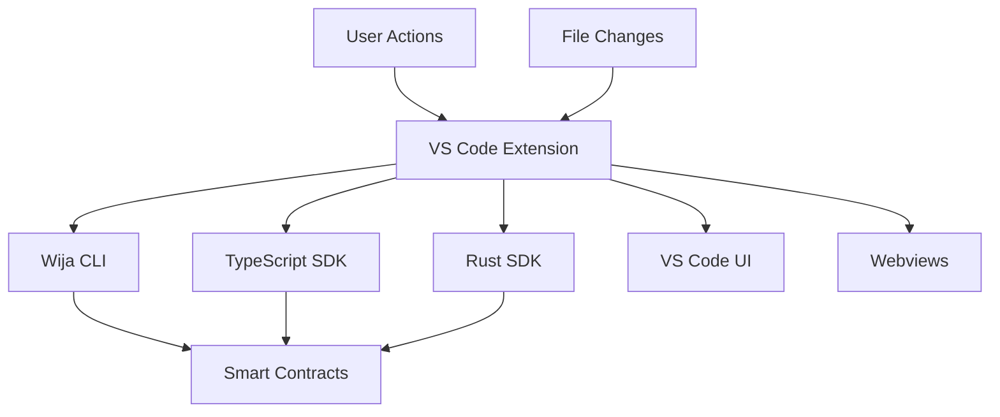

# 🔗 Wija Studio Extension - Monorepo Integration

This document explains how the Wija Studio VS Code extension integrates with the existing Wija monorepo ecosystem.

## 🏗️ **Monorepo Architecture Integration**

### **Package Structure**
```
wija/
├── packages/
│   ├── core/                    # Anchor smart contracts
│   ├── sdk-typescript/          # TypeScript SDK
│   ├── sdk-rust/               # Rust SDK
│   ├── cli/                    # Adaptive CLI
│   └── cursor-extension/       # 🔮 VS Code Extension (NEW)
│       ├── src/
│       ├── package.json
│       └── README.md
├── adr/                        # Architecture Decision Records
└── package.json               # Root workspace configuration
```

### **Shared Dependencies**
The extension leverages existing monorepo infrastructure:

```json
{
  "dependencies": {
    "@solana/web3.js": "^2.0.0",
    "@coral-xyz/anchor": "^0.31.1",
    "@lightprotocol/zk-compression-sdk": "^0.8.0"
  }
}
```

## 🔄 **CLI Integration Points**

### **Context Detection Reuse**
The extension reuses the CLI's existing context detection system:

```typescript
// Extension uses CLI's context detection
const { stdout } = await execAsync('wija context agents', { cwd: folderPath });
const agents = JSON.parse(stdout);

// Falls back to manual detection if CLI unavailable
const agents = await this.manualAgentDetection(folderPath);
```

### **Command Execution**
Extension commands wrap CLI operations with UI feedback:

```typescript
// Deploy agent through CLI
await execAsync(`wija agent deploy ${selectedAgent} --network ${network}`, { cwd });

// Create channel through CLI  
await execAsync(`wija channel create ${channelName} --visibility ${visibility}`, { cwd });
```

### **Configuration Sharing**
Shares configuration with CLI and SDKs:

```typescript
// Read existing .wija/config.json
const configPath = path.join(folderPath, '.wija', 'config.json');
const networkConfig = JSON.parse(await fs.promises.readFile(configPath, 'utf8'));
```

## 📦 **SDK Integration Points**

### **TypeScript SDK Usage**
Direct integration with the TypeScript SDK:

```typescript
// Import SDK types and utilities (when implemented)
import { AgentService, ChannelService } from '@wija/sdk-typescript';
import type { IWijaProjectContext } from '@wija/types';

// Use SDK for blockchain operations
const agentService = new AgentService(connection, wallet);
await agentService.registerAgent(capabilities, metadataUri);
```

### **Rust SDK Integration**
Integration points for Rust development:

```typescript
// Generate Rust code from IDL
await execAsync(`wija codegen rust ${idlPath}`, { cwd });

// Use Rust SDK for performance-critical operations
// (Future implementation with wasm-pack integration)
```

### **Smart Contract Integration**
Works with existing Anchor programs:

```typescript
// Load IDL from existing smart contracts
const idlPath = path.join(folderPath, 'target', 'idl', 'agent_registry.json');
const anchorIDL = JSON.parse(await fs.promises.readFile(idlPath, 'utf8'));

// Generate SDK code from IDL
const program = new anchor.Program(anchorIDL, programId, provider);
```

## 🎯 **Unified Development Experience**

### **Project Detection Hierarchy**
1. **Wija Workspace**: Full monorepo with all packages
2. **Mixed Project**: Multiple SDKs + Anchor programs
3. **Anchor Program**: Smart contract development
4. **TypeScript SDK**: Client application development
5. **Rust SDK**: Performance-critical applications

### **Context-Aware Features**
Different features based on detected context:

```typescript
interface IWijaProjectContext {
  type: 'wija-workspace' | 'anchor-program' | 'typescript-sdk' | 'rust-sdk' | 'mixed-workspace';
  hasAnchor: boolean;
  hasTypeScript: boolean;
  hasRust: boolean;
  hasWijaCLI: boolean;
  capabilities: string[];
}
```

### **Command Availability**
Commands appear based on project context:

```json
{
  "command": "wija.deployAgent",
  "when": "wija.projectDetected && wija.walletConnected"
},
{
  "command": "wija.generateSDKCode", 
  "when": "wija.anchorIDL && resourceExtname == .json"
}
```

## 🚀 **Build System Integration**

### **Monorepo Scripts**
Extension integrates with existing build system:

```json
{
  "scripts": {
    "build:all": "bun run build:core && bun run build:sdks && bun run build:cli && bun run build:extension",
    "build:extension": "cd packages/cursor-extension && bun run compile",
    "test:extension": "cd packages/cursor-extension && bun run test"
  }
}
```

### **Development Workflow**
```bash
# Root level - builds everything including extension
bun install
bun run build:all

# Extension specific
cd packages/cursor-extension
bun run watch    # Development mode
bun run package  # Create VSIX
```

### **CI/CD Integration**
Extension included in CI/CD pipeline:

```yaml
# .github/workflows/build.yml
- name: Build Extension
  run: |
    cd packages/cursor-extension
    bun install
    bun run compile
    bun run test
    bun run package
```

## 🔧 **Shared Configuration**

### **TypeScript Configuration**
Extends root TypeScript configuration:

```json
{
  "extends": "../../tsconfig.json",
  "compilerOptions": {
    "target": "ES2020",
    "module": "commonjs",
    "strict": false
  }
}
```

### **ESLint Configuration**
Uses shared linting rules:

```json
{
  "extends": ["../../.eslintrc.json"],
  "rules": {
    "@typescript-eslint/no-explicit-any": "off"
  }
}
```

### **Workspace Configuration**
Part of Bun workspace:

```json
{
  "workspaces": [
    "packages/*"
  ]
}
```

## 📊 **State Management**

### **Context Sharing**
Extension shares context with other tools:

```typescript
// Read CLI context
const cliContext = await this.readCliContext();

// Share with other VS Code extensions
await vscode.commands.executeCommand('setContext', 'wija.projectType', context.type);

// Update workspace state
await this.context.workspaceState.update('wija.lastNetwork', network);
```

### **Configuration Synchronization**
Keeps configuration in sync across tools:

```typescript
// Watch for CLI config changes
const configWatcher = vscode.workspace.createFileSystemWatcher('**/.wija/config.json');
configWatcher.onDidChange(() => this.reloadConfiguration());

// Update VS Code settings when CLI config changes
await vscode.workspace.getConfiguration('wija').update('network.defaultCluster', newCluster);
```

## 🎪 **Extension Lifecycle in Monorepo**

### **Development Phase**
1. **Setup**: `cd packages/cursor-extension && bun install`
2. **Development**: `bun run watch` + F5 in VS Code
3. **Testing**: `bun run test`
4. **Building**: `bun run compile`

### **Distribution Phase**
1. **Package**: `bun run package` → Creates VSIX
2. **Publish**: `vsce publish` (when ready)
3. **Integration**: Users install from marketplace

### **Maintenance Phase**
1. **Version Sync**: Keep in sync with CLI/SDK versions
2. **API Updates**: Update when SDK APIs change
3. **Bug Fixes**: Coordinate with other package updates

## 🔄 **Data Flow Architecture**



## 🎯 **Benefits of Monorepo Integration**

### **For Developers**
- **Single Clone**: Get all tools in one repository
- **Consistent APIs**: All tools use same interfaces
- **Shared Types**: No duplicate type definitions
- **Unified Testing**: Test extension against real implementations

### **For Maintenance**
- **Version Synchronization**: All components stay in sync
- **Shared Dependencies**: Reduce duplication and conflicts
- **Integrated CI/CD**: Single pipeline for all tools
- **Consistent Documentation**: Unified documentation strategy

### **For Users**
- **Seamless Integration**: All tools work together perfectly
- **Consistent Experience**: Same patterns across CLI and extension
- **Reliable Updates**: Coordinated releases prevent breaking changes
- **Complete Toolkit**: Everything needed for Wija development

## 🚧 **Future Integration Opportunities**

### **Enhanced SDK Integration**
- Direct TypeScript/Rust SDK imports (when available)
- Shared WebAssembly modules for performance
- Cross-language type generation

### **Advanced CLI Integration**
- Real-time CLI output streaming
- Interactive CLI commands through extension
- Shared authentication and key management

### **Ecosystem Extensions**
- Plugin system for third-party integrations
- Shared configuration for ecosystem tools
- Cross-tool analytics and telemetry

---

## 🎪 **Integration Philosophy**

> **"The extension doesn't replace existing tools—it enhances them with visual interfaces and seamless workflows."**

The Wija Studio extension exemplifies the monorepo philosophy: shared code, consistent APIs, and unified experiences. By integrating deeply with existing CLI and SDK tools, it provides a complete development environment while maintaining the modularity and flexibility that makes each tool valuable on its own.

**The result**: A development experience that feels like magic, where the boundary between command-line tools and visual interfaces disappears. 🔮✨ 