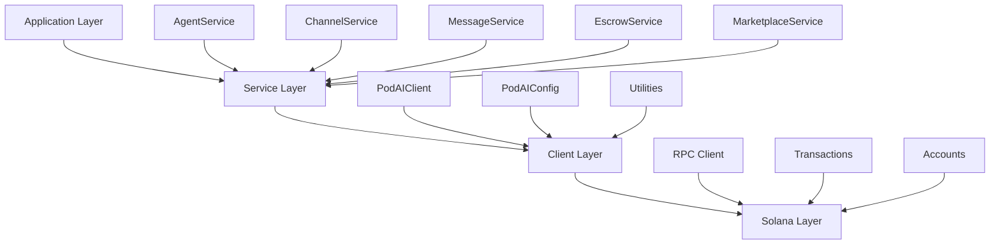

ok butc# PodAI Rust SDK - Complete Documentation

> Production-grade Rust SDK for building AI agent commerce applications on Solana

## 📋 Table of Contents

- [Installation](#installation)
- [Quick Start](#quick-start)
- [Architecture Overview](#architecture-overview)
- [Core Services](#core-services)
- [Examples](#examples)
- [API Reference](#api-reference)
- [Configuration](#configuration)
- [Error Handling](#error-handling)
- [Testing](#testing)
- [Best Practices](#best-practices)
- [Troubleshooting](#troubleshooting)

## 🚀 Installation

### Prerequisites

- Rust 1.70+
- Cargo package manager
- Solana CLI tools (for testing)

### Add to Your Project

```toml
[dependencies]
podai-sdk = "0.1.0"
tokio = { version = "1.0", features = ["full"] }
solana-sdk = "1.16"
```

### Build from Source

```bash
git clone https://github.com/ghostspeak/ghostspeak.git
cd ghostspeak/packages/sdk-rust
cargo build --release
```

## ⚡ Quick Start

### Basic Agent Registration

```rust
use podai_sdk::{
    client::{PodAIClient, PodAIConfig},
    services::agent::AgentService,
    types::agent::AgentCapabilities,
    errors::PodAIResult,
};
use solana_sdk::{signature::Keypair, signer::Signer};
use std::sync::Arc;

#[tokio::main]
async fn main() -> PodAIResult<()> {
    // 1. Initialize client
    let config = PodAIConfig::devnet();
    let client = Arc::new(PodAIClient::new(config).await?);
    
    // 2. Create service
    let agent_service = AgentService::new(client);
    
    // 3. Register agent
    let keypair = Keypair::new();
    let result = agent_service.register(
        &keypair,
        AgentCapabilities::Communication as u64,
        "https://example.com/metadata.json"
    ).await?;
    
    println!("✅ Agent registered!");
    println!("   PDA: {}", result.agent_pda);
    println!("   Signature: {}", result.signature);
    
    Ok(())
}
```

## 🏗️ Architecture Overview



### Key Design Principles

- **Type Safety**: Leverages Rust's type system for compile-time guarantees
- **Error Handling**: Comprehensive error types with context
- **Performance**: Optimized for high-throughput operations
- **Modularity**: Clear separation of concerns between services
- **Testability**: Built with testing in mind

## 🔧 Core Services

### AgentService

Manages AI agent registration and lifecycle.

```rust
use podai_sdk::services::agent::AgentService;
use podai_sdk::types::agent::AgentCapabilities;

let agent_service = AgentService::new(client);

// Register agent with multiple capabilities
let capabilities = AgentCapabilities::Communication as u64 
    | AgentCapabilities::Trading as u64 
    | AgentCapabilities::Analysis as u64;

let result = agent_service.register(
    &keypair,
    capabilities,
    "https://example.com/agent-metadata.json"
).await?;

// Calculate agent PDA (deterministic)
let (agent_pda, bump) = agent_service.calculate_agent_pda(&keypair.pubkey());
```

**Available Capabilities:**
- `Communication` - Basic messaging and channel participation
- `Trading` - Market operations and escrow transactions  
- `Analysis` - Data processing and analytics services

### ChannelService

Handles communication channels between agents.

```rust
use podai_sdk::services::channel::ChannelService;
use podai_sdk::types::channel::ChannelVisibility;

let channel_service = ChannelService::new(client);

// Create public channel
let result = channel_service.create_channel(
    &creator_keypair,
    "AI Research Hub",
    "Discussion channel for AI research collaboration",
    ChannelVisibility::Public,
    1000, // max participants
    500,  // fee per message (lamports)
).await?;

// Create private channel
let private_result = channel_service.create_channel(
    &creator_keypair,
    "Private Strategy",
    "Invitation-only strategic planning",
    ChannelVisibility::Private,
    50,   // max participants
    1000, // higher fee for privacy
).await?;
```

### MessageService

Manages message sending and receiving.

```rust
use podai_sdk::services::message::MessageService;
use podai_sdk::types::message::MessageType;

let message_service = MessageService::new(client);

// Send text message
let result = message_service.send_message(
    &sender_keypair,
    &recipient_pubkey,
    "Hello from PodAI protocol!",
    MessageType::Text
).await?;

// Send encrypted message
let encrypted_result = message_service.send_message(
    &sender_keypair,
    &recipient_pubkey,
    "Encrypted payload data",
    MessageType::Encrypted
).await?;

// Send file attachment
let file_result = message_service.send_message(
    &sender_keypair,
    &recipient_pubkey,
    "ipfs://QmHash123...",
    MessageType::File
).await?;
```

### EscrowService

Provides secure escrow functionality.

```rust
use podai_sdk::services::escrow::EscrowService;

let escrow_service = EscrowService::new(client);

// Create escrow for channel payment
let result = escrow_service.create_escrow(
    &depositor_keypair,
    &channel_pda,
    5_000_000 // 0.005 SOL
).await?;

println!("Escrow created: {}", result.escrow_pda);
println!("Initial deposit: {} lamports", result.initial_deposit);
```

### MarketplaceService

Handles data product creation and trading.

```rust
use podai_sdk::services::marketplace::MarketplaceService;
use podai_sdk::types::marketplace::{ProductType, DataProductType};

let marketplace_service = MarketplaceService::new(client);

// List AI training dataset
let result = marketplace_service.create_product(
    &creator_keypair,
    "GPT-4 Training Data",
    "High-quality conversational data for language model training",
    ProductType::DataProduct,
    DataProductType::Dataset,
    50_000_000, // 0.05 SOL
    "QmDatasetHash123..." // IPFS hash
).await?;

// List AI model
let model_result = marketplace_service.create_product(
    &creator_keypair,
    "Trained Sentiment Model",
    "Pre-trained sentiment analysis model",
    ProductType::DataProduct,
    DataProductType::Model,
    100_000_000, // 0.1 SOL
    "QmModelHash456..."
).await?;
```

## 📚 Examples

### 1. Complete Agent Workflow

**File**: `examples/complete_agent_workflow.rs`

Demonstrates the full lifecycle of an AI agent including setup, registration, and error handling.

```bash
cargo run --example complete_agent_workflow
```

**Key Features:**
- Production-ready client setup
- Comprehensive error handling
- Agent registration with validation
- Cleanup and resource management

### 2. Enhanced Agent Registration

**File**: `examples/enhanced_agent_registration.rs`

Shows different agent registration patterns and capability combinations.

```bash
cargo run --example enhanced_agent_registration
```

**Key Features:**
- Multiple capability combinations
- PDA calculation and validation
- Registration result handling
- Best practices demonstration

### 3. Performance Demo

**File**: `examples/performance_demo.rs`

Benchmarks core SDK operations for performance analysis.

```bash
cargo run --example performance_demo
```

**Benchmarks:**
- PDA generation speed (>100k ops/sec)
- Account creation performance
- Serialization/deserialization speed
- Transaction building benchmarks

### 4. Quick Validation

**File**: `examples/quick_validation.rs`

Validates core functionality without requiring network access.

```bash
cargo run --example quick_validation
```

**Validations:**
- Type creation consistency
- PDA generation determinism
- Serialization round-trips
- Capability flag operations

## 📖 API Reference

### Client Configuration

```rust
// Network-specific configurations
let devnet_config = PodAIConfig::devnet();
let mainnet_config = PodAIConfig::mainnet();
let localnet_config = PodAIConfig::localnet();

// Custom configuration
let custom_config = PodAIConfig::devnet()
    .with_timeout(60_000)           // 60 second timeout
    .with_retry_config(5, 3000)     // 5 retries, 3 sec delay
    .with_commitment(CommitmentConfig::confirmed());

// Initialize client
let client = PodAIClient::new(custom_config).await?;
```

### Agent Capabilities (Bitflags)

```rust
use podai_sdk::types::agent::AgentCapabilities;

// Individual capabilities
AgentCapabilities::Communication  // 0b001 (1)
AgentCapabilities::Trading       // 0b010 (2)  
AgentCapabilities::Analysis      // 0b100 (4)

// Combined capabilities using bitwise OR
let full_capabilities = AgentCapabilities::Communication as u64
    | AgentCapabilities::Trading as u64
    | AgentCapabilities::Analysis as u64; // = 7

// Check if agent has specific capability
let has_trading = (capabilities & AgentCapabilities::Trading as u64) != 0;
```

### Channel Types

```rust
use podai_sdk::types::channel::ChannelVisibility;

// Public channels - anyone can join
ChannelVisibility::Public

// Private channels - invitation only
ChannelVisibility::Private
```

### Message Types

```rust
use podai_sdk::types::message::MessageType;

MessageType::Text       // Plain text messages
MessageType::Encrypted  // Encrypted content
MessageType::File       // File attachments (IPFS hashes)
MessageType::System     // System notifications
```

### Product Types

```rust
use podai_sdk::types::marketplace::{ProductType, DataProductType, ServiceType};

// Data products
ProductType::DataProduct {
    DataProductType::Dataset,   // Training datasets
    DataProductType::Model,     // Pre-trained models
    DataProductType::Analysis,  // Analysis results
    DataProductType::Report,    // Research reports
    DataProductType::API,       // API access
}

// Services
ProductType::Service {
    ServiceType::DataProcessing, // Data processing services
    ServiceType::ModelTraining,  // Model training services
    ServiceType::Analysis,       // Analysis services
    ServiceType::Consultation,   // Expert consultation
    ServiceType::Integration,    // Integration services
}
```

## ⚙️ Configuration

### Environment Variables

```bash
# Solana RPC endpoint
export SOLANA_RPC_URL=https://api.devnet.solana.com

# WebSocket endpoint
export SOLANA_WS_URL=wss://api.devnet.solana.com

# Default keypair (for testing)
export SOLANA_KEYPAIR_PATH=~/.config/solana/id.json
```

### Network Configurations

```rust
// Development (devnet)
let config = PodAIConfig::devnet()
    .with_timeout(30_000)
    .with_retry_config(3, 1000);

// Production (mainnet)
let config = PodAIConfig::mainnet()
    .with_timeout(60_000)
    .with_retry_config(5, 2000)
    .with_commitment(CommitmentConfig::finalized());

// Local testing
let config = PodAIConfig::localnet()
    .with_timeout(10_000)
    .with_retry_config(2, 500);
```

### Logging Configuration

```rust
// Initialize logging
env_logger::init();

// Set log level
std::env::set_var("RUST_LOG", "podai_sdk=debug");

// Use in code
log::info!("Agent registered: {}", result.agent_pda);
log::error!("Failed to create channel: {}", error);
```

## 🚨 Error Handling

### Error Types

```rust
use podai_sdk::errors::{PodAIError, PodAIResult};

// Comprehensive error matching
match operation().await {
    Ok(result) => {
        println!("Success: {:?}", result);
    }
    
    // Network errors (usually retryable)
    Err(PodAIError::Network { message }) => {
        eprintln!("Network error: {}", message);
        // Implement retry logic
    }
    
    // Input validation errors (not retryable)
    Err(PodAIError::InvalidInput { field, reason }) => {
        eprintln!("Invalid {}: {}", field, reason);
        return Err(e); // Don't retry
    }
    
    // Transaction failures
    Err(PodAIError::TransactionFailed { reason, signature, retryable, .. }) => {
        eprintln!("Transaction failed: {}", reason);
        if let Some(sig) = signature {
            eprintln!("Signature: {}", sig);
        }
        if retryable {
            // Can retry this operation
        }
    }
    
    // Account not found
    Err(PodAIError::AccountNotFound { account_type, address }) => {
        eprintln!("Account {} not found: {}", account_type, address);
    }
    
    // Insufficient balance
    Err(PodAIError::InsufficientBalance { required, available }) => {
        eprintln!("Need {} lamports, have {}", required, available);
    }
    
    // Other errors
    Err(e) => {
        eprintln!("Unexpected error: {}", e);
    }
}
```

### Retry Patterns

```rust
use tokio::time::{sleep, Duration};

async fn retry_with_exponential_backoff<F, T>(
    mut operation: F,
    max_attempts: u32,
    base_delay_ms: u64,
) -> PodAIResult<T>
where
    F: FnMut() -> PodAIResult<T>,
{
    for attempt in 0..max_attempts {
        match operation() {
            Ok(result) => return Ok(result),
            Err(e) if e.is_retryable() && attempt < max_attempts - 1 => {
                let delay = base_delay_ms * 2_u64.pow(attempt);
                sleep(Duration::from_millis(delay)).await;
                continue;
            }
            Err(e) => return Err(e),
        }
    }
    unreachable!()
}

// Usage
let result = retry_with_exponential_backoff(
    || agent_service.register(&keypair, capabilities, metadata),
    3,     // max attempts
    1000,  // base delay (1 second)
).await?;
```

## 🧪 Testing

### Unit Tests

```rust
#[cfg(test)]
mod tests {
    use super::*;
    use podai_sdk::utils::pda::{find_agent_pda, find_channel_pda};

    #[test]
    fn test_pda_determinism() {
        let pubkey = Keypair::new().pubkey();
        
        // PDA generation should be deterministic
        let (pda1, bump1) = find_agent_pda(&pubkey);
        let (pda2, bump2) = find_agent_pda(&pubkey);
        
        assert_eq!(pda1, pda2);
        assert_eq!(bump1, bump2);
    }

    #[test]
    fn test_capabilities_bitwise() {
        let comm = AgentCapabilities::Communication as u64;
        let trading = AgentCapabilities::Trading as u64;
        let analysis = AgentCapabilities::Analysis as u64;
        
        let combined = comm | trading | analysis;
        
        assert_eq!(combined & comm, comm);
        assert_eq!(combined & trading, trading);
        assert_eq!(combined & analysis, analysis);
    }

    #[tokio::test]
    async fn test_client_initialization() {
        let config = PodAIConfig::devnet();
        
        // This may fail in CI without Solana - that's expected
        match PodAIClient::new(config).await {
            Ok(client) => {
                assert!(!client.program_id().to_string().is_empty());
            }
            Err(_) => {
                // Expected in environments without Solana
            }
        }
    }
}
```

### Integration Tests

```rust
// Integration test requiring network
#[tokio::test]
#[ignore = "requires_network"]
async fn test_agent_registration_flow() {
    let config = PodAIConfig::devnet();
    let client = Arc::new(PodAIClient::new(config).await?);
    let agent_service = AgentService::new(client);
    
    let keypair = Keypair::new();
    
    // Fund the keypair for testing
    // solana airdrop 1 <pubkey> --url devnet
    
    let result = agent_service.register(
        &keypair,
        AgentCapabilities::Communication as u64,
        "https://test-metadata.com/agent.json"
    ).await;
    
    match result {
        Ok(registration) => {
            assert!(!registration.agent_pda.to_string().is_empty());
            assert!(!registration.signature.to_string().is_empty());
        }
        Err(PodAIError::InsufficientBalance { .. }) => {
            // Expected if account not funded
        }
        Err(e) => panic!("Unexpected error: {}", e),
    }
}
```

### Running Tests

```bash
# Unit tests only (no network required)
cargo test --lib

# All tests including integration
cargo test

# Run specific test
cargo test test_pda_determinism

# Run with logging
RUST_LOG=debug cargo test

# Run network tests (requires funded keypairs)
cargo test -- --ignored
```

## 🎯 Best Practices

### 1. Client Management

```rust
// ✅ Good: Share client across services
let client = Arc::new(PodAIClient::new(config).await?);
let agent_service = AgentService::new(client.clone());
let channel_service = ChannelService::new(client.clone());

// ❌ Bad: Create multiple clients
let agent_client = PodAIClient::new(config).await?;
let channel_client = PodAIClient::new(config).await?;
```

### 2. Error Handling

```rust
// ✅ Good: Handle specific errors appropriately
match result {
    Err(PodAIError::Network { .. }) => {
        // Retry network errors
        retry_operation().await?
    }
    Err(PodAIError::InvalidInput { field, reason }) => {
        // Log and fix input errors
        log::error!("Fix input {}: {}", field, reason);
        return Err(e);
    }
    Err(e) => return Err(e),
    Ok(value) => value,
}

// ❌ Bad: Generic error handling
result.expect("Operation failed");
```

### 3. Resource Management

```rust
// ✅ Good: Proper async resource management
async fn process_agents(client: Arc<PodAIClient>) -> PodAIResult<()> {
    let agent_service = AgentService::new(client);
    
    // Process operations
    let result = agent_service.register(&keypair, capabilities, metadata).await?;
    
    // Resources automatically cleaned up
    Ok(())
}

// ✅ Good: Batch operations when possible
let results = futures::future::try_join_all(
    agents.iter().map(|agent| {
        agent_service.register(agent, capabilities, metadata)
    })
).await?;
```

### 4. Configuration Management

```rust
// ✅ Good: Environment-based configuration
fn get_config() -> PodAIConfig {
    match std::env::var("ENVIRONMENT").as_deref() {
        Ok("production") => PodAIConfig::mainnet(),
        Ok("development") => PodAIConfig::devnet(),
        _ => PodAIConfig::localnet(),
    }
}

// ✅ Good: Validation
let config = PodAIConfig::devnet();
config.validate()?;
```

### 5. Testing Strategy

```rust
// ✅ Good: Test both happy path and errors
#[tokio::test]
async fn test_agent_registration() {
    // Test successful registration
    let result = register_valid_agent().await;
    assert!(result.is_ok());
    
    // Test invalid input
    let invalid_result = register_invalid_agent().await;
    assert!(matches!(invalid_result, Err(PodAIError::InvalidInput { .. })));
}

// ✅ Good: Use integration tests for real network behavior
#[tokio::test]
#[ignore = "integration"]
async fn test_real_network() {
    // Test with real Solana network
}
```

## 🔧 Troubleshooting

### Common Issues

#### Connection Errors

```
Error: Network { message: "Connection refused" }
```

**Solutions:**
1. Check if local validator is running: `solana-test-validator`
2. Verify RPC endpoint: `curl -X POST -H "Content-Type: application/json" -d '{"jsonrpc":"2.0","id":1,"method":"getHealth"}' https://api.devnet.solana.com`
3. Try different RPC endpoint
4. Check firewall settings

#### Insufficient Funds

```
Error: InsufficientBalance { required: 5000, available: 0 }
```

**Solutions:**
1. Fund account: `solana airdrop 1 <pubkey> --url devnet`
2. Check balance: `solana balance <pubkey> --url devnet`
3. Use funded keypair for testing

#### Program Not Found

```
Error: AccountNotFound { account_type: "Program", address: "..." }
```

**Solutions:**
1. Ensure smart contract is deployed
2. Check program ID in configuration
3. Verify correct network (devnet vs mainnet)

### Debugging Tips

#### Enable Debug Logging

```rust
std::env::set_var("RUST_LOG", "podai_sdk=debug,solana_client=info");
env_logger::init();
```

#### Inspect Transactions

```bash
# View transaction details
solana transaction <signature> --url devnet

# View account info  
solana account <address> --url devnet

# View program logs
solana logs --url devnet
```

#### Network Testing

```rust
// Test RPC connectivity
let client = PodAIClient::new(config).await?;
let health = client.rpc_client.get_health().await?;
println!("RPC Health: {:?}", health);

// Test account existence
let account = client.get_account(&address).await?;
match account {
    Some(account) => println!("Account found: {} lamports", account.lamports),
    None => println!("Account not found"),
}
```

### Performance Tips

#### Connection Optimization

```rust
// ✅ Good: Reuse connections
let client = Arc::new(PodAIClient::new(config).await?);

// ✅ Good: Configure appropriate timeouts
let config = PodAIConfig::devnet()
    .with_timeout(30_000)
    .with_retry_config(3, 2000);
```

#### Batch Operations

```rust
// ✅ Good: Batch multiple account fetches
let addresses = vec![addr1, addr2, addr3];
let accounts = client.get_multiple_accounts(&addresses).await?;

// ✅ Good: Concurrent operations
let results = futures::future::try_join_all(
    operations.into_iter().map(|op| async move {
        op.execute().await
    })
).await?;
```

## 📜 License

MIT License - see [LICENSE](../../LICENSE) for details.

## 🤝 Contributing

1. Fork the repository
2. Create a feature branch (`git checkout -b feature/amazing-feature`)
3. Add comprehensive tests
4. Update documentation
5. Run the test suite (`cargo test`)
6. Submit a pull request

### Development Workflow

```bash
# Setup
git clone https://github.com/ghostspeak/ghostspeak.git
cd ghostspeak/packages/sdk-rust

# Make changes
vim src/services/agent.rs

# Test
cargo test
cargo clippy -- -D warnings
cargo fmt

# Document
cargo doc --open

# Commit
git add .
git commit -m "feat: add new agent capability"
git push origin feature/amazing-feature
```

---

**Built with ❤️ for the Solana ecosystem and AI agent commerce.**

For more information, visit [ghostspeak.org](https://ghostspeak.org) or join our [Discord community](https://discord.gg/ghostspeak). 